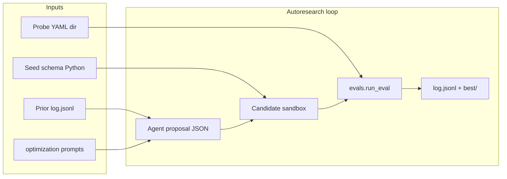

# Graph IR autoresearch harness

This repository includes a **local, file-based research loop** for iterating on a **graph intermediate representation (IR)** used by a psychohistory-style forecasting stack. The goal is not to train the final GNN here, but to **search over schema designs** that score well on benchmark probes while staying honest about epistemic limits.

## What is being optimized?

Four properties, plus an explicit anti-objective:

| Goal                 | Intent                                                                        |
| -------------------- | ----------------------------------------------------------------------------- |
| Expressiveness       | Capture causal, institutional, ideological, and contested structure           |
| GNN-ready projection | Fixed-dimensional, typed projections with explicit constraints                |
| Multi-hop retrieval  | Probe `probe_tasks` shapes should be representable as typed walks / subgraphs |
| Epistemic honesty    | Confidence, contention, provenance, perspectives stay queryable               |

**Anti-objective:** avoid IRs that collapse contested claims into a single central cluster or untyped prose.

Probes under `probes/` are **benchmark inputs** (YAML). The seed schema in `schemas/base_schema.py` registers the union of required node/edge names so structural checks can run immediately; autoresearch proposes edits that remain compatible with the benchmark pack and optional ontology deltas.

## Architecture



## Implemented vs stubbed

| Area                                                                         | Status                                                                |
| ---------------------------------------------------------------------------- | --------------------------------------------------------------------- |
| Pydantic IR schema (`schemas/schema_types.py`)                               | Implemented                                                           |
| Seed registry covering benchmark probes                                      | Implemented (union of `must_represent` / compact-schema variants)     |
| Structural validity (types ⊆ schema)                                         | Implemented                                                           |
| Schema constraints (projection, anti-collapse, persistence hooks)            | Implemented (persistence optional)                                    |
| Functional checks (retrieval task shapes vs node types)                      | Implemented (lightweight; no full graph)                              |
| Strict objective pilot (`golden_tasks`, ablations, complexity budgets)       | Implemented for selected probes; run with `--probe-id` filters         |
| Composite score + JSON report                                                | Implemented                                                           |
| GDELT coverage, traversal QA, Polymarket Brier, persistence ablation metrics | **Stubbed** in `evals/reporting.py` (`StubScores`)                    |
| Automatic LLM calls                                                          | **Not included** — Cursor Agent CLI (or human) writes `proposal.json` |

## Strict objective pilot

Objective eval is strict-only: probes selected for evaluation must provide
`golden_tasks`, `designated_ablations`, and `complexity_budget`. While the full
probe pack is being annotated, run the pilot subset explicitly:

```bash
python -m evals.run_eval \
  --schema schemas.base_schema \
  --probe-dir probes \
  --probe-id roman_family_1A \
  --probe-id roman_family_1B \
  --probe-id 6C-3 \
  --probe-id probe-8a-ukraine-war-sanctions-external-arming-sovereignty-full-scale-invasion \
  --probe-id probe-8b-sudan-war-fragmented-sovereignty-regionalized-armed-competition \
  --out /tmp/psychohistory-strict-pilot-report.json
```

The same `--probe-id` filters can be passed to `autoresearch.runner` during the
next schema-search phase. A strict full-pack eval is expected to fail until all
probe YAML files are annotated.

## Cursor Agent CLI workflow

The prompts are written for an **exploratory** agent: maximize eval outcomes, read prior `log.jsonl` / reports, vary hypotheses—**you do not need to pre-specify each edit**.

1. Attach `@autoresearch/prompts/optimization_target.md`, `@autoresearch/prompts/agent_system.md`, `@schemas/`, and (optionally) `@autoresearch/experiments/log.jsonl`.
2. Ask the agent to write **`proposal.json`** at the repo root (see `autoresearch/agent_interface.py`).
3. Run the harness from the repo root (Python path must include the repo root — use a venv + `pip install -e .` or `PYTHONPATH=.`):

```bash
python -m autoresearch.runner --iterations 1 --probe-dir probes --seed-schema schemas.base_schema --proposal-file ./proposal.json
```

By default, each candidate seeds from `autoresearch/experiments/best/latest` when available, so accepted improvements accumulate across runs.

Without `--proposal-file`, the runner now exits unless you explicitly pass `--allow-noop` (for baselines).

For continuous multi-iteration search, use `--proposal-cmd` so each iteration can regenerate `proposal.json` before eval:

```bash
python -m autoresearch.runner \
  --iterations 5 \
  --probe-dir probes \
  --seed-schema schemas.base_schema \
  --proposal-file ./proposal.json \
  --proposal-cmd 'agent -p "Read autoresearch/prompts/agent_system.md and autoresearch/prompts/optimization_target.md plus autoresearch/experiments/log.jsonl and best/latest evals; write proposal.json."'
```

`--proposal-cmd` supports placeholders: `{proposal_file}`, `{iteration}`, `{prior_best}`, `{candidate_id}`, `{root}`.
When `--proposal-cmd` starts with `agent ...`, the runner now auto-injects `--trust --force --print` if missing so headless agent calls can execute tools/commands.
You can add an adversarial evaluator with `--adversarial-cmd`; the command must print JSON with `adversarial_score` in `[0,1]` (optional: `summary`, `findings`, `regression_flags`). Malformed JSON now fails the iteration instead of being ignored. The score is folded into `stub_scores.adversarial_agent` and the composite.

If you only care about high-level outcomes, keep default concise output (or pass `--concise-output`) and optionally commit only true improvements:

```bash
python -m autoresearch.runner \
  --iterations 8 \
  --probe-dir probes \
  --seed-schema schemas.base_schema \
  --proposal-file ./proposal.json \
  --proposal-cmd 'agent -p "..."' \
  --adversarial-cmd 'bash -lc "echo {\"adversarial_score\":0.7}"' \
  --auto-commit
```

Concise mode prints one line per iteration with score delta and, when improved, the git commit hash/message.
To discourage repeated no-op proposals, unchanged schema candidates incur a small default penalty (`--noop-penalty`, default `0.01`).

## Manual single iteration

```bash
cd /path/to/psychohistory
python -m venv .venv && source .venv/bin/activate
pip install -e ".[dev]"

python -m evals.run_eval \
  --schema schemas.base_schema \
  --probe-dir probes \
  --probe-id roman_family_1A \
  --probe-id roman_family_1B \
  --probe-id 6C-3 \
  --probe-id probe-8a-ukraine-war-sanctions-external-arming-sovereignty-full-scale-invasion \
  --probe-id probe-8b-sudan-war-fragmented-sovereignty-regionalized-armed-competition \
  --out /tmp/report.json
python -m autoresearch.runner --iterations 1 --probe-dir probes --seed-schema schemas.base_schema --allow-noop --probe-id roman_family_1A
```

Help:

```bash
python -m autoresearch.runner --help
python -m evals.run_eval --help
```

## Failure classes (logged)

Recorded in `log.jsonl` when applicable: `syntax_failure`, `schema_invalid`, `eval_crash`, `score_regression`, `incompatible_projection`, `retrieval_regression` (see `autoresearch/logging.py` and `evals/reporting.py`).

## Related code

- Historical sketch: `schema_history/schema_v001.py` (not wired to this harness by default).
