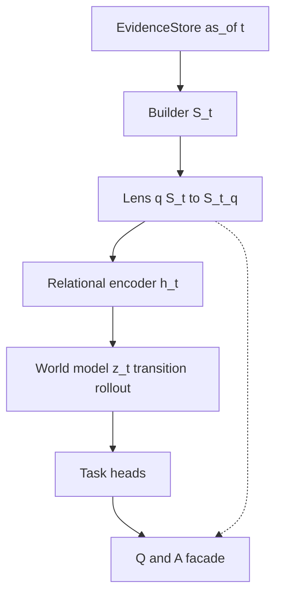

# Target architecture (research)

This document describes the **intended** system—not a snapshot of the current codebase. Existing code (warehouse, snapshots, heterogeneous GNN, baselines) may **implement pieces** of this design behind stable interfaces; it is not the definition of the long-term architecture.

**Related:** program contracts in `project.md`, `roadmap.md`, `forecast_charter.md`; **locked graph-builder + assumption design** in [`../graph-builder-contract-v0.1.md`](../graph-builder-contract-v0.1.md); evaluation in `docs/reviewers-guide.md`; deep-research handoff in `docs/research/research.md`. **Implementation-oriented literature synthesis:** [`docs/research/outputs/perplexity.md`](outputs/perplexity.md).

### Implementation status (codebase vs target)

| Layer           | Role                                | In repo today (approx.)                                                                                                                |
| --------------- | ----------------------------------- | -------------------------------------------------------------------------------------------------------------------------------------- |
| 0 — Evidence    | Warehouse, tapes                    | **Yes** — DuckDB, JSONL ingest.                                                                                                        |
| 1 — Builder     | \(S*t\) from \(E*{\le t}\)          | **Partly** — deterministic **`ingest/snapshot_export`** situation graphs **yes**; **learned** query-conditioned retrieval / sparse subgraph selection **not** first-class yet (`next_steps.md` §2.2 **E**). |
| 2 — Query lens  | \(S_t^{(q)}\)                       | **Mostly not** — contract is documented; benchmarks do not yet implement a general lens module; **research sequencing** treats lens + builder as **before** WM depth (`roadmap.md`).                                        |
| 3 — Encoder     | \(h_t\)                             | **Yes** — `baselines/gnn.py` (hetero GNN).                                                                                             |
| 4 — World model | \(z_t\), multi-step dynamics        | **Partially in code** as **time-then-space** training (`baselines/wm_ablation_train.py`); program order places **WM v0 + multi-step** after **subgraph + assumption** baselines (`next_steps.md` §2.2 **H**). |
| 5 — Heads       | Material / market / epistemological | **Partial** — event forecasting backtests and baselines; market heads TBD.                                                             |
| 6 — Q&A façade  | Routing + packaging                 | **Not** — LLM-as-router is roadmap Stage 8.                                                                                            |

**Execution risk:** the **full stack** is a research target; the **highest-risk gaps** are now **Layers 1–2** (learned builder + query lens with auditability) and an **assumption** representation between lens and encoder, followed by **Layer 4** (WM depth and multi-step losses on a **pinned** subgraph interface). **Training loops should attach to real snapshots first** and grow the stack **builder → assumptions → forecast check → WM** (`next_steps.md` §0–2).

---

## Principles

1. **Evidence, representation, dynamics, and presentation are separate layers** with explicit contracts so components can be swapped or ablated.
2. **Time-travel safety** holds at the evidence boundary: nothing after cutoff \(t\) enters the situation at \(t\).
3. **Relational structure and temporal dynamics are both first-class** and compose: graph(-like) encoding feeds a **world model**; neither layer alone is the whole thesis.
4. **Query-conditioned analysis** may focus scope and attention on \((q, S_t)\) without **inventing** facts not supported by evidence at \(t\).
5. **Training signals are plural** (material labels, markets, SSL, multi-step losses); no single scalar subsumes epistemology.
6. **Discovery** of slow structure is demonstrated by **held-out prediction**, **ablations**, and **stability**—not by fixed narrative priors in the core model.
7. **Natural language controls the interface, not the evidence:** user or agent utterances **compile** to allowed operations on queries, lens, and documented counterfactual classes—never raw free text as hidden facts (see § NL-guided analysis and agent probing).

---

## Layer 0 — Evidence substrate

**Role:** Immutable, timestamped inputs: events, document snippets, market quotes, entity candidates, institutional metadata.

**Contract:** `EvidenceStore.query(as_of=t, scope=…)` returns only what was knowable at or before \(t\).

**Optional implementation:** DuckDB warehouse + JSONL tapes + ingest pipeline in this repo.

---

## Layer 1 — Canonical situation assembly (builder)

**Role:** Map evidence \(E\_{\le t}\) to a structured situation \(S_t\): typed nodes and edges (or hyperedges), text spans, market objects, explicit unknowns. **Learned query-conditioned retrieval** for forecasting is **specified** in [`../graph-builder-contract-v0.1.md`](../graph-builder-contract-v0.1.md) (fixed-budget subgraph, two-stage ANN + rerank, supervision stages, training contexts).

**Subcomponents:**

- **Deterministic / rule-based** extraction and normalization.
- **Entity linking** under point-in-time constraints.
- **Optional learned completion:** soft edges, missing links, weights—**regularized** and trained only as part of the full objective (not a standalone narrative generator).
- **Learned query-conditioned retrieval** (fixed-budget candidates, reranking, sparse selection) when scaling—prefer **staged** objectives so the builder is not only trained through a moving forecast head (`roadmap.md` Stage 6).

**Contract:** `S_t = Build(E_{\le t})`; no future labels in \(S_t\).

**Optional implementation:** `ingest/snapshot_export` and graph artifacts as one `Build` backend.

---

## Layer 2 — Query lens (focus, not forgery)

**Role:** From `(question q, situation S_t)` produce a **working situation** \(S_t^{(q)}\): anchored subgraph, budgeted expansion, and/or attention masks over nodes and relation types.

**Contract:** \(S*t^{(q)} = \mathrm{Lens}(q, S_t)\) must be **derivable from** \(S_t\) without adding factual assertions that are not already supported by \(E*{\le t}\).

This is where analysis is **tuned to the question** without rewriting history. **NL-guided probes** (rephrased questions, emphasis, scope) still instantiate \(\mathrm{Lens}(q, S_t)\) under the same contract; see below.

---

## Layer 3 — Relational encoder

**Role:** Map \(S_t^{(q)}\) to tensor representations \(h_t\) (node-level, graph-level, or both).

**Pluggable implementations:** heterogeneous GNN, graph transformer, typed attention—**interface first**, not a single algorithm.

**Output:** embeddings for downstream dynamics and heads.

**Optional implementation:** `baselines/gnn.py` hetero GNN as encoder v1.

---

## Layer 4 — World model core (temporal heart)

**Role:** Latent dynamics that support **multi-step** consistency and **hypothesis competition**, not only single-step scoring—typically over **query-focused** representations \(S_t^{(q)}\) after the lens and any **assumption** packaging, so temporal depth does not confound an unset retrieval ontology.

**Suggested structure:**

- **State:** continuous \(z_t\) plus optional **mixture** over \(K\) world experts \(\pi_t \in \Delta^K\).
- **Transition:** \(z*{t+1} = f*\theta(z_t, \text{exogenous}\_t)\) with only **past or concurrent** exogenous inputs (no future labels).
- **Observation / emission:** distributions over **observable channels** (events, market paths, text-derived statistics) from \(z*t\) and optional rollouts \(z*{t:t+H}\).

**Training:** multi-horizon predictive losses; self-supervision where labels are thin; **market channel masking** when evaluating transfer to non-market queries.

**Structural discipline (credit assignment):** “Time-then-space” means **two differentiable stages**—per-node temporal update **then** message passing—so **GRU-only vs MP-only vs both** ablations remain meaningful. **Avoid** interleaving recurrence and MP in a single forward pass with no clear boundary; that makes **G5-style** claims hard to defend.

**Discovery discipline:** ablations that remove this module should **hurt** when the module is credited; named historical constructs align **post hoc** or on small probe sets—core training does not hard-code specific shocks as immutable priors if the claim is unsupervised structure.

This layer is the primary locus of **slow-moving structure**, regime-like behavior, and **suppression** (down-weighting) of hypothesis mass under context—without permanent deletion of interpretive components.

---

## Layer 5 — Task heads

**Role:** Map \((z_t, h_t)\) to outputs without collapsing all goals into one scalar.

Typical heads:

- **Material:** calibrated forecasts on sharp observables (events, resolutions, etc.).
- **Market curriculum:** resolution and/or short-horizon dynamics with **explicit, non-leaking** label contracts between heads.
- **Epistemological:** ranked interpretive hypotheses, evidence pointers (graph nodes, text spans), uncertainty—evaluated via **HITL** and rubrics, not fluency alone.

**Optional implementation:** France protest backtest as one **material** benchmark and metrics suite.

---

## Layer 6 — Inference and Q&A façade

**Role:** Parse questions, resolve cutoff \(t\), run builder → lens → encoder → world model → heads; return structured answers with **citations** to evidence and explicit limits.

**Rule:** the language model **routes and packages**; it does **not** author forecasts or evidence by itself.

---

## NL-guided analysis and agent probing (interface contract)

**Intent:** Users should **explore** how different phrasings, emphases, and scenario questions affect **structured** outputs (forecasts, rankings, cited evidence)—without a fixed discrete “action alphabet” for the world model. Automated agents should be able to **search** over probes until a **declared** material criterion is met (e.g. probability threshold, rank, improvement over a baseline). Neither path requires WM inputs to be a small discrete set; **\(z_t\)** and **exogenous** channels can remain high-dimensional. What stays narrow is the **mapping from language to mechanics**.

**Requirements:**

- **Compile, don’t inject:** NL is parsed into **allowed operations**: alternate queries \(q\), lens parameters (subgraph scope, masks, budgeted expansion), and—where explicitly supported—**counterfactual or hypothetical** branches that are **labeled as such** and do not silently rewrite \(E\_{\le t}\) into new “facts.”
- **Auditability:** Each probe has a **trace** (which lens masks moved, which nodes entered scope, which head fired). Compare runs by **diff** on structured outputs and on the trace—not on prose alone.
- **Counterfactuals vs standard forecasts:** If the user or agent asks “what if X,” the system must distinguish **(a)** standard prediction at \(t\) under \(E\_{\le t}\) from **(b)** exploratory branches that relax or substitute assumptions under an explicit contract—so reviewers never confuse hypothetical runs with PIT-grounded forecasts.
- **Agent loops:** Search uses the same compilation boundary; add **budgets** (max probes, cost limits) and, where claims are made, **stability** checks so optimization does not overfit spurious wording.

This section does not change Layer 4’s transition \(z*{t+1} = f*\theta(z_t, \text{exogenous}\_t)\); it specifies how **human and agent intent** enter the stack **above** evidence, through **\(q\)** and **lens**, and optionally through **declared** hypothetical channels—not as unstructured text smuggled into \(S_t\).

---

## Data flow

---

## Optional reuse of this repository

| Existing component                 | Plugs in as                                    |
| ---------------------------------- | ---------------------------------------------- |
| Warehouse / tapes                  | Evidence store adapter                         |
| Snapshot export                    | `Build` implementation                         |
| Recurrence / XGBoost               | Baseline plugins                               |
| Heterogeneous GNN                  | Encoder v1                                     |
| `evals/graph_artifact_contract.py` | Serialization contract for \(S_t\) (or subset) |
| France protest pipeline            | One material evaluation track                  |

---

## Evaluation stance

- **Baselines** remain mandatory for any material claim.
- **Ablations:** encoder-only vs encoder+world model; full graph vs lens-scoped; markets on vs masked.
- **Gates** in `roadmap.md` apply; epistemological claims require review processes described in `docs/reviewers-guide.md`.
