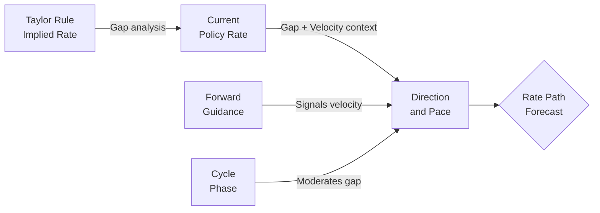

# Taylor Rule Calibration

## Core Principle

The Taylor rule states that a central bank's policy rate should respond to deviations of inflation from target and output from potential:

```
i = r* + π + 0.5(π - π*) + 0.5(y - y*)
```

Where:
- `i` = recommended policy rate
- `r*` = neutral real interest rate (estimated 0.5-1.0% for US)
- `π` = current inflation rate
- `π*` = inflation target (typically 2%)
- `y - y*` = output gap (% deviation)

The **calibration insight** is not the rule itself but the **deviation dynamics**: central banks converge toward the Taylor rate at varying speeds depending on regime, credibility, and forward guidance.

## Key Mechanism: The Gap-and-Velocity Framework



### Three Regimes of Taylor Rule Deviation

| Regime | Gap (Actual - Taylor) | Central Bank Behavior | Forecasting Implication | Canonical Example |
|--------|----------------------|----------------------|------------------------|-------------------|
| **Catching up** | Large negative (actual < Taylor + 2%+) | Hiking rapidly; minutes show concern about falling behind curve | Expect above-trend hikes; front-loading likely | Fed 2022: 525bp in 16 months; actual rate caught up from 0% to ~5.5% |
| **Overshooting** | Negative or near-zero (actual near or slightly below Taylor) | Hold-and-assess; waiting for data to confirm Taylor rate has peaked | Pause phase; cuts unlikely until inflation data confirms sustained decline | Fed Jul-Dec 2023: Holds at 5.25-5.50% as core PCE falls from 4.3% to 3.2% |
| **Normalizing** | Positive (actual > Taylor as inflation falls) | Cut cycle begins; pre-announced or data-dependent easing | Expect first cut within 2-3 meetings; magnitude depends on how fast inflation normalizes | Fed Sep 2024: Cuts 50bp as Taylor-implied rate had fallen ~150bp below actual |
| **Stuck high** | Positive persistent gap | Bank acknowledges restriction but fears premature easing | Extended hold; cuts delayed well past what Taylor rule alone suggests | ECB 2024-25: Held at 4% while Taylor rate fell to 2-3%; recession fears + wage stickiness |

## Calibration Tables

### US Federal Reserve: Taylor Rule Gap History

| Period | Actual Fed Funds | Taylor-Implied | Gap | Regime | Next Move |
|--------|-----------------|----------------|-----|--------|-----------|
| 2022-Q1 | 0.00-0.25% | 2.5-3.5% | -3.0% | Catching up (extreme) | 50-75bp hike each meeting |
| 2022-Q3 | 2.25-2.50% | 4.5-5.5% | -2.5% | Catching up | 75bp hike (hike pace peaks) |
| 2023-Q2 | 5.00-5.25% | 5.0-5.5% | -0.25% | Overshooting → Plateau | Pause signaled; final hike in Jul |
| 2024-Q1 | 5.25-5.50% | 4.5-5.0% | +0.5% | Normalizing | Cuts delayed by sticky services inflation |
| 2024-Q3 | 5.25-5.50% | 3.5-4.0% | +1.5% | Normalizing accelerating | First cut Sep 2024 (50bp) |
| 2025-Q2 | 4.50-4.75% | 3.0-3.5% | +1.25% | Normalizing | Gradual 25bp cuts per quarter |
| 2026-Q1 | 4.00-4.25% | 2.5-3.0% | +1.0% | Normalizing (late stage) | 75-100bp cuts remaining in cycle; r* uncertainty |

### When Taylor Rule Is Less Reliable

The Taylor rule has reduced predictive power in these environments:

1. **Near-zero lower bound (ZLB)**: When rates are near zero, the rule may recommend negative rates that central banks won't implement. Use shadow rate estimates instead.
2. **Supply-shock-driven inflation**: The rule treats all inflation as demand-driven. During supply-shock episodes (2021-22 energy/commodity surge), the rule over-recommends tightening because it doesn't distinguish supply vs demand inflation. Central banks intuitively adjust down.
3. **Structural r* shifts**: The neutral rate (r*) is unobservable and varies. If r* has risen (2024-26 debate: r* may be 1.0-1.5% rather than 0.5%), the Taylor rule underestimates the appropriate terminal rate.
4. **Political regimes**: Central banks under political pressure (TCMB, BCB historically) may deviate from Taylor rule for extended periods. See [[domains/mena/concepts/em-central-bank-credibility-normalization]].

## Forecasting Application

### Step 1: Estimate the Taylor-Implied Rate at Cutoff
```
Parameters needed:
- Current core inflation (PCE for Fed, HICP for ECB)
- Current output gap estimate (CBO, IMF, or consensus)
- r* estimate (Laubach-Williams, Holston-Laubach-Williams, or Fed SEP median)
- Historical Taylor rule coefficient (standard: 0.5 each, but varies)

Quick estimate for US:
  Taylor rate = r*(1.0%) + core PCE(2.7%) + 0.5(core PCE - 2%) + 0.5(output gap)
```

### Step 2: Determine the Regime
Match the current gap to one of the four regimes above. This determines the default next-move direction and approximate velocity.

### Step 3: Cross-Check With Forward Guidance
The Taylor rule is the structural anchor. [[domains/economics/concepts/central-bank-forward-guidance]] provides the near-term tactical signal. When forward guidance diverges from Taylor rule for more than 3 months, the forward guidance is more likely to converge toward the Taylor rule than vice versa.

### Step 4: Apply Threshold for First Move
| Regime | First Move Timing Rule |
|--------|----------------------|
| Catching up (gap > 1.5%) | First move within 1-2 meetings; 50bp+ likely |
| Catching up (gap 0.5-1.5%) | First move within 2-3 meetings; 25bp likely |
| Overshooting → Plateau | No move for 3-5 meetings; data-dependent |
| Normalizing (gap 0.5-1.5%) | First cut within 2-4 meetings; 25bp or 50bp |
| Normalizing (gap > 1.5%) | First cut within 1-2 meetings; 50bp likely |

## Relationship to Monetary Policy Cycle Phases

The Taylor rule gap and the [[domains/economics/concepts/monetary-policy-cycle-phases/_concept]] are complementary:

- **Cycle phase** tells you WHERE the central bank is in its framework (tightening → plateau → easing → normalization)
- **Taylor rule gap** tells you HOW MUCH runway remains in the current phase

Example: In the plateau phase (mid-2023), cycle-phase analysis told you the Fed was holding. Taylor gap analysis told you the holding period would be ~12-18 months because the gap was small and inflation was falling slowly. Combined, they produced the correct "hold through 2024-Q3" forecast.

## Cross-References

- [[domains/economics/concepts/monetary-policy-cycle-phases/_concept]] — Phase identification framework
- [[domains/economics/concepts/central-bank-forward-guidance]] — Near-term tactical signal
- [[domains/economics/concepts/yield-curve-dynamics]] — Yield curve response to Taylor rule positioning
- [[domains/economics/concepts/debt-sustainability-framework]] — Fiscal dimension
- [[domains/economics/concepts/dollar-smile-theory]] — Dollar regime linkages
- [[domains/mena/concepts/em-central-bank-credibility-normalization]] — EM extension when political constraints are active
- [[timeline/2022-Q1]] through [[timeline/2026-Q2]] — Quarter files with Taylor-relevant data
